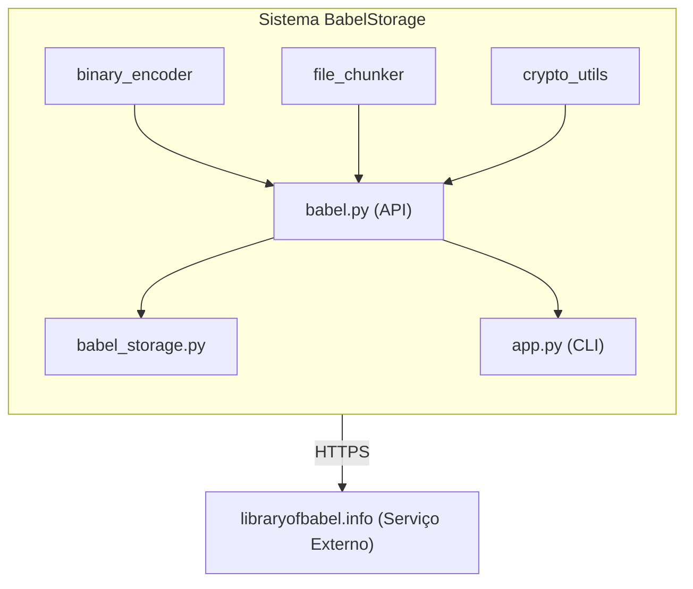

# BabelStorage

> Um sistema de armazenamento de arquivos distribuído usando a Biblioteca de Babel como uma camada de armazenamento imutável e pública

[](https://opensource.org/licenses/MIT)
[](https://www.python.org/downloads/)
[](docs/)

## Resumo

**BabelStorage** implementa uma abordagem inovadora para armazenamento de arquivos, aproveitando a [Biblioteca de Babel](https://libraryofbabel.info) — um site contendo todas as combinações possíveis de 3200 caracteres — como uma camada de armazenamento determinística e imutável. Em vez de armazenar arquivos diretamente, o BabelStorage armazena apenas as *coordenadas* de onde o conteúdo do arquivo codificado existe dentro do vasto espaço combinatório da Biblioteca.

Esta abordagem oferece:
*   **Custo de armazenamento zero** — arquivos não são armazenados, apenas localizados
*   **Imutabilidade** — o conteúdo não pode ser alterado ou excluído
*   **Verificação** — verificações criptográficas de integridade no nível do chunk e do arquivo
*   **Determinismo** — o mesmo arquivo sempre mapeia para as mesmas coordenadas

O sistema comprime arquivos usando Zstandard, os divide em chunks, codifica cada chunk no alfabeto de Babel (base-29), procura por coordenadas e armazena metadados compactos com assinaturas RSA opcionais para verificação de autenticidade.

## Sumário

*   [Arquitetura](#arquitetura)
*   [Especificações do Protocolo](#especificações-do-protocolo)
*   [Instalação](#instalação)
*   [Início Rápido](#início-rápido)
*   [Uso da CLI](#uso-da-cli)
*   [Interface Web](#interface-web)
*   [Formato de Metadados](#formato-de-metadados)
*   [Considerações de Segurança](#considerações-de-segurança)
*   [Desempenho e Limitações](#desempenho-e-limitações)
*   [Desenvolvimento](#desenvolvimento)
*   [Contribuição](#contribuição)
*   [Licença](#licença)

## Arquitetura

### Componentes do Sistema



### Descrições dos Componentes

#### 1. **binary_encoder.py**
Gerencia a conversão bidirecional entre dados binários arbitrários e o alfabeto de 29 caracteres da Biblioteca de Babel (`abcdefghijklmnopqrstuvwxyz .,`).

**Principais Características:**
*   Codificação Base-29 com resultados determinísticos
*   Estrutura de prefixo versionada (compatível com BSP v1-v4)
*   Cálculo de overhead: ~1.647× tamanho original
*   Suporta decodificação legada (compatibilidade retroativa)

**Detalhes Técnicos:**
*   Conjunto de caracteres: 29 símbolos (26 letras + espaço, ponto, vírgula)
*   Esquema de codificação: prefixo estruturado com campos de comprimento
*   Marcador de versão: `d` para BSP v5

#### 2. **file_chunker.py**
Gerencia a compressão de arquivos, chunking, verificação de integridade e reconstrução.

**Principais Características:**
*   Compressão Zstandard (nível 19) antes do chunking
*   Verificações de integridade SHA-256 (por chunk e arquivo completo)
*   Serialização compacta de metadados (JSON gzipped)
*   Tamanho máximo do chunk: ~1850 bytes (antes da codificação)

**Detalhes Técnicos:**
*   Compressão: `zstd` com nível 19 para máxima taxa
*   Cálculo do tamanho do chunk: `MAX_BABEL_PAGE_SIZE / ENCODING_OVERHEAD - 8`
*   Formato de metadados: Arrays compactos para minimizar o armazenamento
*   Versão do protocolo: BSP v5

#### 3. **crypto_utils.py**
Fornece assinaturas digitais baseadas em RSA para autenticação de metadados.

**Principais Características:**
*   Geração de chaves RSA (4096 bits recomendado)
*   Esquema de assinatura RSA-PSS com SHA-256
*   Serialização JSON canônica para consistência da assinatura
*   Codificação Base64 para transporte da assinatura

**Detalhes Técnicos:**
*   Algoritmo: RSA-PSS com MGF1(SHA-256)
*   Comprimento do salt: PSS.MAX_LENGTH
*   Preenchimento: PKCS#1 PSS
*   Formato da chave: PEM (PKCS#8 para privada, SubjectPublicKeyInfo para pública)

#### 4. **babel.py**
Wrapper de cliente HTTP para a API da Biblioteca de Babel.

**Principais Características:**
*   Interface de busca para encontrar coordenadas de texto
*   Interface de navegação para recuperar conteúdo de página
*   Lógica de repetição com backoff exponencial
*   Análise de HTML com BeautifulSoup4
*   Validação de entrada e tratamento de erros

**Detalhes Técnicos:**
*   Tempo limite: 60 segundos (configurável)
*   Estratégia de repetição: 5 tentativas com backoff de 2×
*   Formato de coordenadas: hexágono (3200 caracteres), parede (1-4), prateleira (1-5), volume (1-32), página
*   Comprimento máximo de busca: 3200 caracteres

#### 5. **babel_storage.py** (CLI)
Interface de linha de comando para operações de arquivo.

**Comandos:**
*   `upload` — Comprime, codifica, busca e armazena coordenadas
*   `download` — Recupera, decodifica, descomprime e verifica
*   `verify-metadata` — Verificação de integridade offline (assinatura + estrutura)
*   `info` — Exibe detalhes dos metadados

**Recursos:**
*   Rastreamento de progresso com lógica de repetição
*   Modo estrito (interrompe em qualquer falha de verificação)
*   Verificação de assinatura (opcional)
*   Log detalhado para depuração

#### 6. **app.py** (Interface Web)
Aplicativo web baseado em Flask para acesso via navegador.

**Recursos:**
*   Upload de arquivos com arrastar e soltar
*   Monitoramento de progresso em tempo real
*   Listagem de arquivos com busca/ordenação
*   Download direto do navegador
*   UI responsiva (inspirada no Google Drive)

**Detalhes Técnicos:**
*   Framework: Flask com suporte a threading
*   Rastreamento de progresso: Dicionário thread-safe com locks
*   Manipulação de upload: Workers em segundo plano com threads daemon
*   Download: Reconstrução em memória com BytesIO

## Especificações do Protocolo

BabelStorage implementa o **Protocolo BabelStorage (BSP)**, uma especificação versionada para codificação, chunking e verificação de arquivos usando a Biblioteca de Babel.

### Evolução do Protocolo

| Versão | Recursos | Status |
|---------|----------|--------|
| BSP v1  | Integridade SHA-256 no nível do arquivo |  Implementado |
| BSP v2  | Checksums SHA-256 por chunk |  Implementado |
| BSP v3  | Codificação binária estruturada |  Implementado |
| BSP v4  | Assinaturas de metadados RSA-PSS |  Implementado |
| BSP v5  | Modo estrito + verificação offline |  Implementado (atual) |

### Especificações Formais

As especificações detalhadas do protocolo estão disponíveis no diretório `docs/`:

*   [RFC 0001](docs/rfc-0001.md) — Integridade no Nível do Arquivo (BSP v1)
*   [RFC 0002](docs/rfc-0002.md) — Checksums por Chunk (BSP v2)
*   [RFC 0003](docs/rfc-0003.md) — Especificação de Codificação Binária
*   [RFC 0004](docs/rfc-0004.md) — Assinatura de Metadados (BSP v4)
*   [RFC 0005](docs/rfc-0005.md) — Modo Estrito e Verificação Offline (BSP v5)
*   [RFC 0006](docs/rfc-0006.md) — Extensões Futuras e Roteiro

## Instalação

### Requisitos

*   Python 3.10 ou superior
*   Conexão com a internet (para acesso à Biblioteca de Babel)
*   ~100MB de espaço em disco livre (para dependências)

### Dependências

```
    beautifulsoup4==4.14.3
    blinker==1.9.0
    certifi==2026.1.4
    cffi==2.0.0
    charset-normalizer==3.4.4
    click==8.3.1
    colorama==0.4.6
    cryptography==46.0.5
    Flask==3.1.2
    idna==3.11
    itsdangerous==2.2.0
    Jinja2==3.1.6
    MarkupSafe==3.0.3
    pycparser==3.0
    requests==2.32.5
    soupsieve==2.8.3
    typing_extensions==4.15.0
    urllib3==2.6.3
    Werkzeug==3.1.5
    zstandard==0.25.0

```

### Configuração

1.  **Clone o repositório:**
    ```bash
    git clone https://github.com/yourusername/babelstorage.git
    cd babelstorage
    ```

2.  **Crie o ambiente virtual:**
    ```bash
    python -m venv env
    source env/bin/activate  # No Windows: env\Scripts\activate
    ```

3.  **Instale as dependências:**
    ```bash
    pip install -r requirements.txt
    ```

4.  **Gere chaves RSA (opcional, para assinatura):**
    ```bash
    python -c "from crypto_utils import generate_keys; generate_keys(\'private.pem\', \'public.pem\')"
    ```

**Nota de Segurança:** Mantenha `private.pem` seguro e nunca o envie para o controle de versão!

## Início Rápido

### Fazer Upload de um Arquivo

```bash
# Upload básico
python babel_storage.py upload document.pdf --metadata document.json.gz

# Com assinatura
python babel_storage.py upload document.pdf \
    --metadata document.json.gz \
    --privkey private.pem
```

### Fazer Download de um Arquivo

```bash
# Download básico
python babel_storage.py download document.json.gz --output restored.pdf

# Com verificação
python babel_storage.py download document.json.gz \
    --output restored.pdf \
    --pubkey public.pem \
    --strict
```

### Verificar Metadados (Offline)

```bash
python babel_storage.py verify-metadata document.json.gz \
    --pubkey public.pem \
    --strict
```

### Visualizar Informações do Arquivo

```bash
python babel_storage.py info document.json.gz
```

## Uso da CLI

### Comando Upload

```bash
python babel_storage.py upload <arquivo> --metadata <saida.json.gz> [opções]

Opções:
  --privkey PATH    Assinar metadados com chave privada
  --quiet           Suprimir saída de progresso
```

## Roteiro de Desenvolvimento

### Curto Prazo (v1.1)
*   [ ] Uploads de chunk paralelos com limitação de taxa
*   [ ] Retomada de progresso após interrupção
*   [ ] Melhorias na UI Web (melhores mensagens de erro)
*   [ ] Suíte de testes abrangente
*   [ ] Containerização Docker
*   [ ] Escolha de nível de compressão

### Médio Prazo (v1.2)
*   [ ] Árvore Merkle para verificação parcial
*   [ ] Opção de criptografia do lado do cliente
*   [ ] Estratégias de redundância/backup de metadados
*   [ ] Melhorias na UI Web (Arrastar e soltar múltiplos arquivos, etc.)

### Longo Prazo (v2.0)
*   [ ] Pool de workers distribuídos para uploads
*   [ ] Backends de armazenamento alternativos (integração IPFS?)
*   [ ] Deduplicação entre usuários
*   [ ] Recursos empresariais (cotas, logs de auditoria)

Veja [RFC 0006](docs/rfc-0006.md) para planos futuros detalhados.

## Perguntas Frequentes

**P: Isso realmente armazena arquivos na Biblioteca de Babel?**
R: Sim e não. A Biblioteca de Babel contém todas as combinações possíveis de 3200 caracteres. Os chunks codificados do seu arquivo já "existem" na biblioteca — nós apenas encontramos e registramos suas coordenadas.

**P: O que acontece se a Biblioteca de Babel ficar offline?**
R: Você não conseguirá recuperar arquivos até que ela volte a ficar online. É por isso que o backup de metadados é crítico — ele contém todas as coordenadas necessárias para recuperar seus arquivos.

**P: Posso usar isso em produção?**
R: BabelStorage é experimental. Para uso em produção, considere:
*   Backups regulares de metadados
*   Monitoramento de disponibilidade do serviço
*   Conformidade com a limitação de taxa
*   Armazenamento alternativo para dados críticos

**P: Como isso é diferente do IPFS ou de outros armazenamentos distribuídos?**
R: O IPFS armazena dados reais em nós. O BabelStorage armazena apenas coordenadas em uma "biblioteca" existente e imutável de todas as combinações de texto possíveis. É mais uma prova de conceito explorando o armazenamento determinístico.

**P: Meus dados são privados?**
R: Não. A Biblioteca de Babel é pública. Não faça upload de dados sensíveis sem criptografia do lado do cliente.

**P: Como posso confiar que os dados não foram adulterados?**
R: Use o modo `--strict` e a verificação de assinatura. Hashes SHA-256 garantem a integridade, e assinaturas RSA provam a autenticidade.

## Licença

Este projeto é licenciado sob a Licença MIT — veja o arquivo [LICENSE](LICENSE) para detalhes.


---

**Aviso Legal**: BabelStorage é um projeto experimental. A Biblioteca de Babel é um serviço de terceiros sem SLA. Use por sua conta e risco. Sempre mantenha backups de dados importantes.
