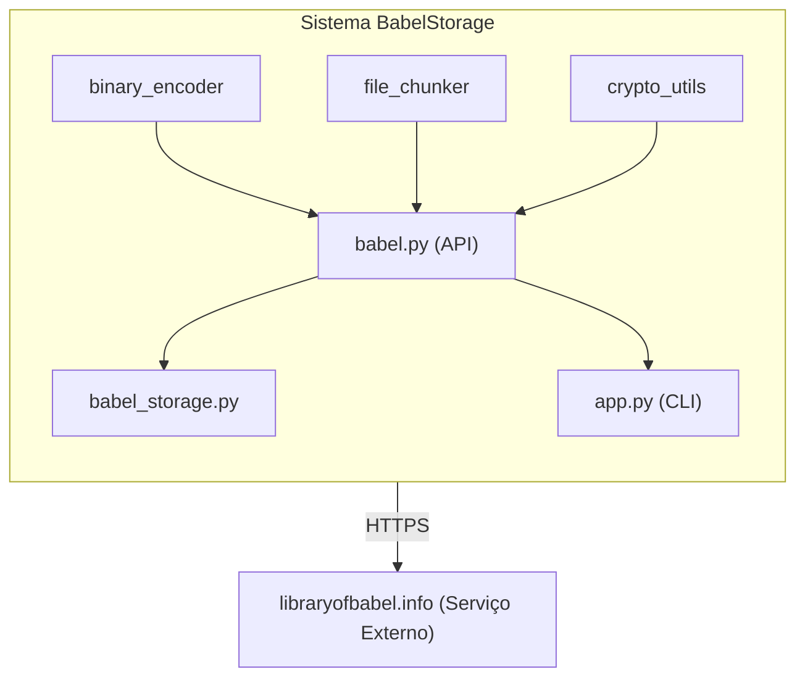

# BabelStorage

> Um sistema de armazenamento de arquivos distribuído usando a Biblioteca de Babel como uma camada de armazenamento imutável e pública.

[](https://opensource.org/licenses/MIT)
[](https://www.python.org/downloads/)
[](docs/)

## Resumo

**BabelStorage** implementa uma abordagem inovadora para armazenamento de arquivos, aproveitando a [Biblioteca de Babel](https://libraryofbabel.info) — um site contendo todas as combinações possíveis de 3200 caracteres — como uma camada de armazenamento determinística e imutável. Em vez de armazenar arquivos diretamente, o BabelStorage armazena apenas as *coordenadas* de onde o conteúdo do arquivo codificado existe dentro do vasto espaço combinatório da Biblioteca.

Esta abordagem oferece:
*   **Custo de armazenamento zero** — arquivos não são armazenados, apenas localizados
*   **Imutabilidade** — o conteúdo não pode ser alterado ou excluído
*   **Verificação** — verificações criptográficas de integridade no nível do chunk e do arquivo
*   **Determinismo** — o mesmo arquivo sempre mapeia para as mesmas coordenadas

O sistema comprime arquivos usando Zstandard, os divide em chunks, codifica cada chunk no alfabeto de Babel (base-29), procura por coordenadas e armazena metadados compactos com assinaturas RSA opcionais para verificação de autenticidade.

## Sumário

*   [Arquitetura](#arquitetura)
*   [Especificações do Protocolo](#especificações-do-protocolo)
*   [Instalação](#instalação)
*   [Início Rápido](#início-rápido)
*   [Uso da CLI](#uso-da-cli)
*   [Interface Web](#interface-web)
*   [Roteiro de Desenvolvimento](#roteiro-de-desenvolvimento)
*   [Perguntas Frequentes](#perguntas-frequentes)
*   [Licença](#licença)

## Arquitetura

### Componentes do Sistema


```mermaid
flowchart TD
    subgraph BabelStorage["Sistema BabelStorage"]
        direction TB

        %% Módulos internos
        binary_encoder["binary_encoder"]
        file_chunker["file_chunker"]
        crypto_utils["crypto_utils"]

        %% API
        babel_api["babel.py (API)"]

        %% Outras partes
        babel_storage["babel_storage.py"]
        app_cli["app.py (CLI)"]

        %% Conexões
        binary_encoder --> babel_api
        file_chunker --> babel_api
        crypto_utils --> babel_api
        babel_api --> babel_storage
        babel_api --> app_cli
    end

    %% Serviço externo
    library["libraryofbabel.info (Serviço Externo)"]

    %% Conexão externa
    BabelStorage -->|HTTPS| library

```

### Descrições dos Componentes

#### 1. **binary_encoder.py**
Gerencia a conversão bidirecional entre dados binários arbitrários e o alfabeto de 29 caracteres da Biblioteca de Babel (`abcdefghijklmnopqrstuvwxyz .,`).

**Principais Características:**
*   Codificação Base-29 com resultados determinísticos
*   Estrutura de prefixo versionada (compatível com BSP v1-v4)
*   Cálculo de overhead: ~1.647× tamanho original
*   Suporta decodificação legada (compatibilidade retroativa)

**Detalhes Técnicos:**
*   Conjunto de caracteres: 29 símbolos (26 letras + espaço, ponto, vírgula)
*   Esquema de codificação: prefixo estruturado com campos de comprimento
*   Marcador de versão do encoding: `d` (enc-v4), usado pelos protocolos BSP v4, v5 e v6

#### 2. **file_chunker.py**
Gerencia a compressão de arquivos, chunking, verificação de integridade e reconstrução.

**Principais Características:**
*   Compressão Zstandard (nível 19) antes do chunking
*   Verificações de integridade SHA-256 (por chunk e arquivo completo)
*   Raiz de árvore Merkle sobre os hashes por chunk (BSP v6)
*   Serialização compacta de metadados (JSON gzipped)
*   Tamanho máximo do chunk: ~1813 bytes (antes da codificação)

**Detalhes Técnicos:**
*   Compressão: `zstd` com nível 19 para máxima taxa
*   Cálculo do tamanho do chunk: `MAX_BABEL_PAGE_SIZE / ENCODING_OVERHEAD - 8`
*   Formato de metadados: Arrays compactos para minimizar o armazenamento
*   Versão do protocolo: BSP v6

#### 3. **crypto_utils.py**
Fornece assinaturas digitais baseadas em RSA para autenticação de metadados.

**Principais Características:**
*   Geração de chaves RSA (4096 bits recomendado)
*   Esquema de assinatura RSA-PSS com SHA-256
*   Serialização JSON canônica para consistência da assinatura
*   Codificação Base64 para transporte da assinatura

**Detalhes Técnicos:**
*   Algoritmo: RSA-PSS com MGF1(SHA-256)
*   Comprimento do salt: PSS.MAX_LENGTH
*   Preenchimento: PKCS#1 PSS
*   Formato da chave: PEM (PKCS#8 para privada, SubjectPublicKeyInfo para pública)

#### 3.1 **merkle.py**
Constrói a árvore Merkle SHA-256 sobre os hashes por chunk e gera/valida provas de inclusão (BSP v6).

**Principais Características:**
*   Raiz determinística (folhas = hashes por chunk, duplicação do último nó em nível ímpar)
*   Provas de inclusão de comprimento ⌈log₂N⌉
*   Verificação de prova sem acesso à rede
*   Trabalha diretamente sobre os hashes hex já presentes nos metadados

#### 4. **babel.py**
Wrapper de cliente HTTP para a API da Biblioteca de Babel.

**Principais Características:**
*   Interface de busca para encontrar coordenadas de texto
*   Interface de navegação para recuperar conteúdo de página
*   Lógica de repetição com backoff exponencial
*   Análise de HTML com BeautifulSoup4
*   Validação de entrada e tratamento de erros

**Detalhes Técnicos:**
*   Tempo limite: 60 segundos (configurável)
*   Estratégia de repetição: 5 tentativas com backoff de 2×
*   Formato de coordenadas: hexágono (3200 caracteres), parede (1-4), prateleira (1-5), volume (1-32), página
*   Comprimento máximo de busca: 3200 caracteres

#### 5. **babel_storage.py** (CLI)
Interface de linha de comando para operações de arquivo.

**Comandos:**
*   `upload` — Comprime, codifica, busca e armazena coordenadas
*   `download` — Recupera, decodifica, descomprime e verifica
*   `verify-metadata` — Verificação de integridade offline (assinatura + estrutura + raiz Merkle)
*   `verify-chunk` — Prova a autenticidade de um único chunk via prova Merkle (BSP v6)
*   `info` — Exibe detalhes dos metadados

**Recursos:**
*   Rastreamento de progresso com lógica de repetição
*   Modo estrito (interrompe em qualquer falha de verificação)
*   Verificação de assinatura (opcional)
*   Log detalhado para depuração

#### 6. **app.py** (Interface Web)
Aplicativo web baseado em Flask para acesso via navegador.

O `app.py` **não reimplementa o protocolo**: ele instancia a mesma classe
`BabelStorage` usada pela CLI e apenas traduz os eventos de progresso do motor
para JSON. Isso garante que as verificações BSP não possam divergir entre os
dois modos.

**Recursos:**
*   Upload de arquivos com arrastar e soltar
*   Assinatura RSA opcional da metadata (equivalente a `--privkey`)
*   Modo estrito e verificação de assinatura no download (`--strict`, `--pubkey`)
*   Verificação offline da metadata (equivalente a `verify-metadata`)
*   Inspeção completa de chunks e coordenadas (equivalente a `info`)
*   Exportação e importação do artefato `.json.gz`
*   Monitoramento de progresso em tempo real (upload **e** download)
*   Listagem de arquivos com busca, filtros e ordenação
*   UI responsiva (inspirada no Google Drive)

**Detalhes Técnicos:**
*   Framework: Flask com suporte a threading
*   Motor compartilhado: `babel_storage.BabelStorage` com `progress_cb`
*   Rastreamento de jobs: Dicionário thread-safe com locks e expiração (TTL)
*   Manipulação de upload/download: Workers em segundo plano com threads daemon
*   Download: Reconstrução em memória com BytesIO, entregue por job
*   Proteção contra Path Traversal em todos os identificadores de arquivo

## Especificações do Protocolo

BabelStorage implementa o **Protocolo BabelStorage (BSP)**, uma especificação versionada para codificação, chunking e verificação de arquivos usando a Biblioteca de Babel.

### Evolução do Protocolo

| Versão | Recursos | Status |
|---------|----------|--------|
| BSP v1  | Integridade SHA-256 no nível do arquivo |  Implementado |
| BSP v2  | Checksums SHA-256 por chunk |  Implementado |
| BSP v3  | Codificação binária estruturada |  Implementado |
| BSP v4  | Assinaturas de metadados RSA-PSS |  Implementado |
| BSP v5  | Modo estrito + verificação offline |  Implementado |
| BSP v6  | Raiz Merkle + verificação parcial de chunk |  Implementado (atual) |

### Especificações Formais

As especificações detalhadas do protocolo estão disponíveis no diretório `docs/`:

*   [RFC 0001](docs/rfc-0001.md) — Integridade no Nível do Arquivo (BSP v1)
*   [RFC 0002](docs/rfc-0002.md) — Checksums por Chunk (BSP v2)
*   [RFC 0003](docs/rfc-0003.md) — Especificação de Codificação Binária
*   [RFC 0004](docs/rfc-0004.md) — Assinatura de Metadados (BSP v4)
*   [RFC 0005](docs/rfc-0005.md) — Modo Estrito e Verificação Offline (BSP v5)
*   [RFC 0006](docs/rfc-0006.md) — Extensões Futuras e Roteiro
*   [RFC 0007](docs/rfc-0007.md) — Verificação por Árvore Merkle (BSP v6)

## Instalação

### Requisitos

*   Python 3.10 ou superior
*   Conexão com a internet (para acesso à Biblioteca de Babel)
*   ~100MB de espaço em disco livre (para dependências)

### Dependências

```
    beautifulsoup4==4.14.3
    blinker==1.9.0
    certifi==2026.1.4
    cffi==2.0.0
    charset-normalizer==3.4.4
    click==8.3.1
    colorama==0.4.6
    cryptography==46.0.5
    Flask==3.1.2
    idna==3.11
    itsdangerous==2.2.0
    Jinja2==3.1.6
    MarkupSafe==3.0.3
    pycparser==3.0
    requests==2.32.5
    soupsieve==2.8.3
    typing_extensions==4.15.0
    urllib3==2.6.3
    Werkzeug==3.1.5
    zstandard==0.25.0

```

### Configuração

1.  **Clone o repositório:**
    ```bash
    git clone https://github.com/Sonael/babelstorage.git
    cd babelstorage
    ```

2.  **Crie o ambiente virtual:**
    ```bash
    python -m venv env
    source env/bin/activate  # No Windows: env\Scripts\activate
    ```

3.  **Instale as dependências:**
    ```bash
    pip install -r requirements.txt
    ```

4.  **Gere chaves RSA (opcional, para assinatura):**
    ```bash
    python -c "from crypto_utils import generate_keys; generate_keys(\'private.pem\', \'public.pem\')"
    ```
    Ou, pela interface web, use o botão **Generate RSA-4096 key pair** em
    **Server Settings** (ícone de engrenagem).

**Nota de Segurança:** Mantenha `private.pem` seguro e nunca o envie para o controle de versão! O `.gitignore` já cobre `*.pem`.

## Início Rápido

### Fazer Upload de um Arquivo

```bash
# Upload básico
python babel_storage.py upload document.pdf --metadata document.json.gz

# Com assinatura
python babel_storage.py upload document.pdf \
    --metadata document.json.gz \
    --privkey private.pem
```

### Fazer Download de um Arquivo

```bash
# Download básico
python babel_storage.py download document.json.gz --output restored.pdf

# Com verificação
python babel_storage.py download document.json.gz \
    --output restored.pdf \
    --pubkey public.pem \
    --strict
```

### Verificar Metadados (Offline)

```bash
python babel_storage.py verify-metadata document.json.gz \
    --pubkey public.pem \
    --strict
```

### Visualizar Informações do Arquivo

```bash
python babel_storage.py info document.json.gz
```

## Uso da CLI

### Comando Upload

```bash
python babel_storage.py upload <arquivo> --metadata <saida.json.gz> [opções]

Opções:
  --privkey PATH         Assinar metadados com chave privada (BSP v4)
  --rate-limit SEGUNDOS  Intervalo entre chunks (padrão 1.5s; 0 desativa)
  --max-retries N        Tentativas por chunk antes de desistir (padrão 4)
  --retry-delay SEGUNDOS Backoff inicial entre tentativas, dobra a cada vez (padrão 2s)
  --no-resume            Ignorar metadata parcial e reenviar todos os chunks
  --quiet                Suprimir saída de progresso
```

**Retomada automática**: se o upload for interrompido, basta rodar o mesmo
comando de novo. A metadata é salva a cada chunk e serve como arquivo de
progresso — os chunks já enviados são pulados (reencontrar suas coordenadas é
determinístico). A retomada só ocorre quando o arquivo é o mesmo (verificado
pelo hash); um arquivo alterado recomeça do zero. Use `--no-resume` para forçar
o reenvio completo.

**Rate limit**: o intervalo padrão de 1.5s entre chunks existe para não
sobrecarregar o `libraryofbabel.info`, um serviço de terceiros gratuito. Ajuste
com `--rate-limit` apenas se souber o que está fazendo.

### Comando Download

```bash
python babel_storage.py download <metadata.json.gz> --output <arquivo> [opções]

Opções:
  --pubkey PATH          Verificar a assinatura da metadata antes de baixar
  --strict               Abortar em qualquer falha de integridade (BSP v5)
  --max-retries N        Tentativas por chunk antes de desistir (padrão 4)
  --retry-delay SEGUNDOS Backoff inicial entre tentativas (padrão 2s)
  --quiet                Suprimir saída de progresso
```

### Comando verify-metadata

```bash
python babel_storage.py verify-metadata <metadata.json.gz> --pubkey <chave.pem> [opções]

Opções:
  --strict          Tratar avisos como falhas
  --quiet           Suprimir saída de progresso
```

Não acessa a rede. Verifica assinatura, campos obrigatórios, contagem de
chunks, formato dos hashes SHA-256, estrutura das coordenadas e a raiz Merkle.

### Comando verify-chunk (BSP v6)

```bash
python babel_storage.py verify-chunk <metadata.json.gz> --index <N> [opções]

Opções:
  --pubkey PATH     Verificar a assinatura da metadata antes (recomendado)
  --strict          Reservado para simetria com os demais comandos
  --quiet           Suprimir saída de progresso
```

Recupera **apenas** o chunk `N` da Biblioteca de Babel e prova sua autenticidade
contra a raiz Merkle através de uma prova de inclusão (⌈log₂N⌉ hashes), sem baixar
o arquivo inteiro. Só funciona com metadados BSP v6. Consulte a
[RFC 0007](docs/rfc-0007.md).

### Comando Info

```bash
python babel_storage.py info <metadata.json.gz>
```

### Códigos de Saída

Conforme a [RFC 0005](docs/rfc-0005.md) Seção 2.4:

| Código | Significado |
|--------|-------------|
| 0 | Todas as verificações passaram |
| 1 | Incompatibilidade de hash de chunk em modo estrito |
| 2 | Hash final do arquivo incorreto |
| 3 | Assinatura RSA inválida |
| 4 | Dados ausentes (coordenadas, campos obrigatórios) |

## Interface Web

A interface web expõe **todas** as operações da CLI através do navegador. Ambos
os modos executam o mesmo motor (`babel_storage.BabelStorage`), então o
comportamento de verificação é idêntico.

### Executando

```bash
python app.py
```

Por padrão o servidor escuta em `http://127.0.0.1:5000`.

### Configuração

Há dois grupos de configuração.

**Configurações editáveis** — ajustáveis pelo painel **Server Settings** (ícone
de engrenagem) **em tempo real**, sem reiniciar, e persistidas em
`babel_config.json`. Cada uma tem um equivalente na CLI/ambiente:

| Configuração | Padrão | Web (Settings) | CLI / env |
|--------------|--------|----------------|-----------|
| Intervalo entre chunks | `1.5s` | Rate limit | `upload --rate-limit` · `BABEL_RATE_LIMIT` |
| Tamanho máx. de upload | `100 MB` | Max upload size | `BABEL_MAX_FILE_SIZE` (bytes) |
| Tentativas por chunk | `4` | Retries per chunk | `--max-retries` · `BABEL_MAX_RETRIES` |
| Backoff inicial de retry | `2s` | Retry backoff | `--retry-delay` · `BABEL_RETRY_DELAY` |
| Modo estrito padrão | `on` | Strict by default | `--strict` · `BABEL_STRICT` |

Precedência na inicialização: padrões → variáveis de ambiente →
`babel_config.json` (a última edição feita pela interface vence). Para voltar
aos padrões, apague o `babel_config.json`.

**Configurações de inicialização** — só via ambiente, exigem reiniciar o
servidor (não editáveis pela web por segurança):

| Variável | Padrão | Descrição |
|----------|--------|-----------|
| `BABEL_HOST` | `127.0.0.1` | Endereço de escuta |
| `BABEL_PORT` | `5000` | Porta |
| `BABEL_DEBUG` | `0` | Debugger do Werkzeug (**nunca** ligue em rede pública: ele executa código arbitrário) |
| `BABEL_PRIVATE_KEY` | `private.pem` | Chave usada para assinar metadados |
| `BABEL_PUBLIC_KEY` | `public.pem` | Chave usada para verificar assinaturas |
| `BABEL_CONFIG_FILE` | `babel_config.json` | Onde as configurações editáveis são persistidas |

O painel **Server Settings** também traz o botão **Generate RSA-4096 key pair**
para criar o par de chaves sem sair do navegador (equivalente ao
`crypto_utils.generate_keys`). A chave privada é escrita apenas no servidor e
nunca é devolvida ao navegador; regenerar por cima de uma chave existente exige
confirmação, pois invalida toda metadata já assinada.

### Equivalência com a CLI

| Ação na web | Equivalente na CLI |
|-------------|--------------------|
| **Upload File** | `upload <arquivo> --metadata <saida.json.gz>` |
| **Upload File** + *Sign metadata* | `upload ... --privkey private.pem` |
| **Download** (com *Strict mode* ligado) | `download ... --strict --pubkey public.pem` |
| **Verify** (escudo) | `verify-metadata ... --pubkey public.pem [--strict]` |
| **Verify** de um chunk (escudo por linha no Info) | `verify-chunk ... --index N --pubkey public.pem` |
| **Info** (círculo de informação) | `info <metadata.json.gz>` |
| **Export metadata** | o próprio arquivo `--metadata` |
| **Import metadata** | copiar um `.json.gz` para `metadata/` |

O botão **Export metadata** é o mais importante da interface: o `.json.gz` é a
única coisa que torna um arquivo recuperável. O **Import metadata** aceita
qualquer `.json.gz` gerado pela CLI, permitindo restaurar pelo navegador algo
que foi enviado pelo terminal.

### Modo Estrito

O interruptor **Strict mode** na barra de ferramentas vale para downloads e
verificações, exatamente como a flag `--strict`:

*   **Ligado** — o restauro aborta no primeiro chunk cujo SHA-256 não confere.
*   **Desligado** — a divergência é registrada como aviso e o restauro continua
    (normalmente falhando depois na descompressão ou no hash final).

### Endpoints da API

| Método | Rota | Descrição |
|--------|------|-----------|
| `GET` | `/api/config` | Configurações atuais, limites e info do servidor |
| `POST` | `/api/settings` | Atualiza e persiste configurações editáveis (rate, max upload, retries, strict) |
| `POST` | `/api/keys/generate` | Gera o par de chaves RSA no servidor (aceita `{"force": bool}`) |
| `POST` | `/api/files/<id>/resign` | Re-assina a metadata com a chave atual |
| `GET` | `/api/files` | Lista os arquivos com estado de assinatura |
| `GET` | `/api/files/<id>/info` | Metadados completos e coordenadas dos chunks |
| `POST` | `/api/files/<id>/verify` | Verificação offline (aceita `{"strict": bool}`) |
| `POST` | `/api/files/<id>/verify-chunk` | Verificação parcial de um chunk via Merkle (aceita `{"index": N}`) |
| `GET` | `/api/files/<id>/metadata` | Baixa o artefato `.json.gz` |
| `POST` | `/api/metadata/import` | Importa um `.json.gz` |
| `POST` | `/api/estimate` | Estimativa real de chunks e tempo (com compressão) |
| `POST` | `/api/upload` | Inicia o upload (campo `sign=1` para assinar) |
| `GET` | `/api/upload/progress/<id>` | Progresso do upload |
| `POST` | `/api/download/<id>/start` | Inicia o restauro em segundo plano |
| `GET` | `/api/download/job/<job>` | Progresso do restauro |
| `GET` | `/api/download/job/<job>/file` | Entrega os bytes restaurados (uso único) |
| `GET` | `/api/download/<id>` | Restauro síncrono, para scripts |
| `DELETE` | `/api/delete/<id>` | Remove a metadata |

O restauro é assíncrono porque leva cerca de 1 segundo por chunk: servir os
bytes na mesma requisição deixaria o navegador em uma conexão sem resposta e
sem qualquer indicação de progresso.

### Limitações

*   O upload de um arquivo grande leva minutos (~1,5 s por chunk por conta do
    rate limiting da Biblioteca de Babel). Mantenha a aba aberta.
*   Um restauro concluído fica em memória no servidor até ser buscado ou
    expirar (15 minutos).
*   Não há autenticação. O servidor é para uso local; qualquer pessoa com
    acesso à porta pode ler, enviar e apagar metadados.

## Roteiro de Desenvolvimento

### Curto Prazo (v1.1)
*   [ ] Uploads de chunk paralelos com limitação de taxa
*   [x] Retomada de progresso após interrupção (CLI: reexecute o mesmo `upload`)
*   [x] Paridade da UI Web com a CLI (assinatura, modo estrito, verificação, info)
*   [x] Melhorias na UI Web (mensagens de erro com dicas acionáveis)
*   [ ] Suíte de testes abrangente
*   [ ] Containerização Docker
*   [ ] Escolha de nível de compressão

### Médio Prazo (v1.2)
*   [x] Árvore Merkle para verificação parcial (BSP v6 — [RFC 0007](docs/rfc-0007.md))
*   [ ] Opção de criptografia do lado do cliente
*   [ ] Estratégias de redundância/backup de metadados
*   [ ] Melhorias na UI Web (Arrastar e soltar múltiplos arquivos, etc.)

### Longo Prazo (v2.0)
*   [ ] Pool de workers distribuídos para uploads
*   [ ] Backends de armazenamento alternativos (integração IPFS?)
*   [ ] Deduplicação entre usuários
*   [ ] Recursos empresariais (cotas, logs de auditoria)

Veja [RFC 0006](docs/rfc-0006.md) para planos futuros detalhados.

## Perguntas Frequentes

**P: Isso realmente armazena arquivos na Biblioteca de Babel?**
R: Sim e não. A Biblioteca de Babel contém todas as combinações possíveis de 3200 caracteres. Os chunks codificados do seu arquivo já "existem" na biblioteca — nós apenas encontramos e registramos suas coordenadas.

**P: O que acontece se a Biblioteca de Babel ficar offline?**
R: Você não conseguirá recuperar arquivos até que ela volte a ficar online. É por isso que o backup de metadados é crítico — ele contém todas as coordenadas necessárias para recuperar seus arquivos.

**P: Posso usar isso em produção?**
R: BabelStorage é experimental. Para uso em produção, considere:
*   Backups regulares de metadados
*   Monitoramento de disponibilidade do serviço
*   Conformidade com a limitação de taxa
*   Armazenamento alternativo para dados críticos

**P: Como isso é diferente do IPFS ou de outros armazenamentos distribuídos?**
R: O IPFS armazena dados reais em nós. O BabelStorage armazena apenas coordenadas em uma "biblioteca" existente e imutável de todas as combinações de texto possíveis. É mais uma prova de conceito explorando o armazenamento determinístico.

**P: Meus dados são privados?**
R: Não. A Biblioteca de Babel é pública. Não faça upload de dados sensíveis sem criptografia do lado do cliente.

**P: Como posso confiar que os dados não foram adulterados?**
R: Use o modo `--strict` e a verificação de assinatura. Hashes SHA-256 garantem a integridade, e assinaturas RSA provam a autenticidade.

## Licença

Este projeto é licenciado sob a Licença MIT — veja o arquivo [LICENSE](LICENSE) para detalhes.


---

**Aviso Legal**: BabelStorage é um projeto experimental. A Biblioteca de Babel é um serviço de terceiros sem SLA. Use por sua conta e risco. Sempre mantenha backups de dados importantes.
